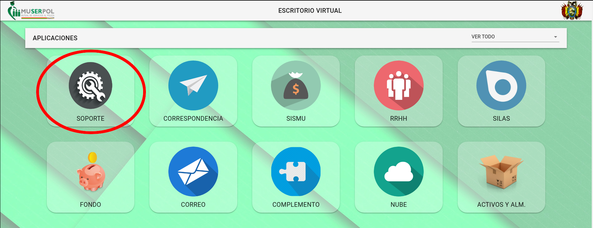
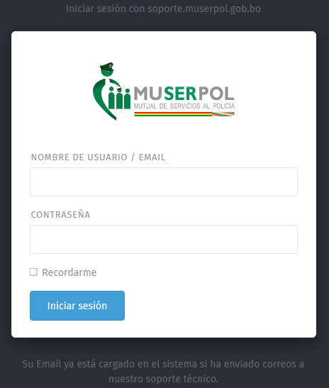
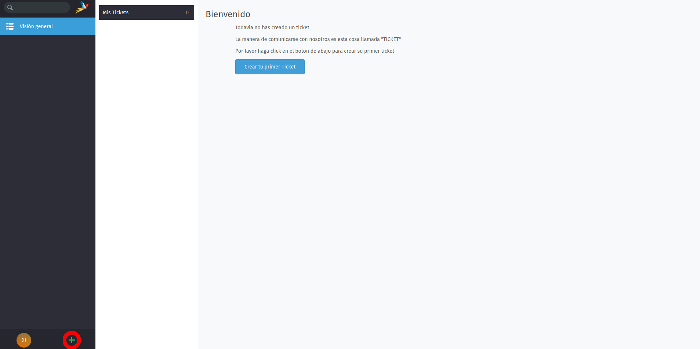
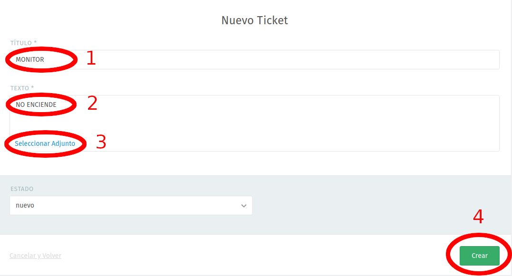
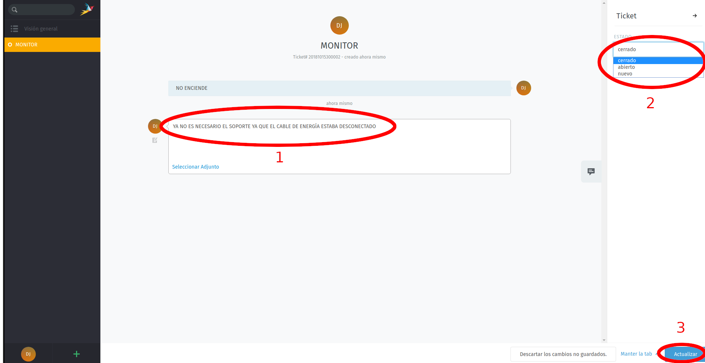

# MANUAL DE USUARIO
## PLATAFORMA VIRTUAL ADMINISTRATIVA
## MÓDULO SOPORTE TÉCNICO

### 1. INGRESO AL SISTEMA

Este sistema es compatible con los navegadores Firefox y Chrome, para acceder al sistema se debe acceder al enlace:

[http://intranet.muserpol.gob.bo](http://intranet.muserpol.gob.bo)

A continuación seleccionar el ícono de SOPORTE:

O de otra forma acceder directamente al enlace:

[http://soporte.muserpol.gob.bo:9001](http://soporte.muserpol.gob.bo:9001)

Ahora se abrirá el sistema de Soporte Técnico:

Debe ingresar el usuario y contraseña provistos por el personal de sistemas.

### 2. USO DEL SISTEMA

En la siguiente página se muestra un resumen de todos los tickets de soporte abiertos y cerrados.

Para abrir un ticket de soporte técnico debe hacer click en el botón “+” ubicado en la parte inferior izquierda de la pantalla:

Esta operación abrirá un formulario que debe ser llenado de acuerdo al tipo de soporte que se requiere:

En el ejemplo se muestra un ticket abierto por la razón ficticia de una impresora que dejó de imprimir por alguna razón desconocida. Los espacios disponibles para llenar son los siguientes:

  1. TÍTULO: El objetivo por el cual se requiere soporte técnico
  2. TEXTO: Un detalle, lo más claro posible, del problema por el cual se abrió el ticket
  3. ADJUNTO: En caso de ser necesario se pueden enviar archivos adjuntos
  4. CREAR: Envía el ticket que será atendido por el personal de soporte técnico

Se puede observar que se abrió el ticket ya que aparece en la lista de la izquierda en color amarillo. Los tickets solucionados cambiarán a color verde para identificarlos. En esta nueva pantalla se observan los siguientes campos que pueden ser alterados por el usuario:

  1. CHAT: Intercambio de mensajes con el personal de soporte técnico a cargo del ticket, este chat solo hace referencia al objetivo del ticket y cambiará de acuerdo a cada ticket
  2. ESTADO: Cambiar el estado del ticket que puede ser cerrado o abierto
  3. ACTUALIZAR: Cambia el estado del ticket y/o envía los mensajes de la caja de chat